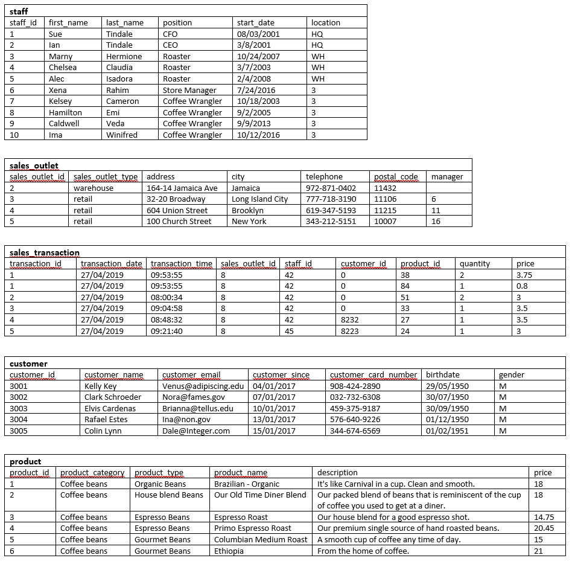
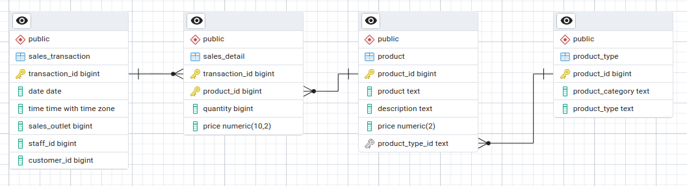

# EdX: IBM Data Engineering

## Relational Database Basics

### Module One: Relational Database Concepts (with a bit of module two)

When modelling a database, there is a logical (information) model and a physical (data) model. The logical model, in the form of an ERD, abstracts the complexity of real world entities, helps to understand business concepts and rules and is the blueprint from which the physical model is created. The physical model defines the data element types, constraints, relationships and all the logical design in the SQL specific to the RDBMS you are using.

The relational model allows for logical, physical, and physical storage independence. Logical allows for conceptual changes (DDL) without having to change external schemas or programs above it. Physical allows for indexes and other physical attributes without a change to the conceptual/logical schema. Physical storage means that where the backend data is stored doesn't effect the physical or logical spaces.

The database architecure deployment topology could tbe single tier, client server, three tier, or cloud based. The deployment topology of the architecture can include hardware and software configuration, and network components, depending on factors like scalability, performance, and reliability. Single tier has the database, the app, and the UI on the same server. Client server has the UI on one server, the app and database on another. Three tier further sepearates the app from the database server. There is also cloud deployment.

Distributed or clustered architecture can lead to enhances like scalability, fault tolerance, and performance, whether shared disk, shared nothing, replication, partitioning, and sharding.

When creating a data model there are constraints that help ensure integrity. Primary key creation for entity integrity constraint, ensuring records can be identified within a table. Referential integrity, using foreign keys to ensure correct links between tables. Domain constraint, using domain knowledge to ensure meaningfulness of the data, e.g. a cell can only have a certain range of values. Default values, null constraints can also be good. Not necessarily in the data model, but using views to allow specialized access to subsets of the data for security/privacy, and efficiency is also handy.

### Module Two: Using Relational Databases

This module introduced DDL and DML statements, nothing new to me in those that were presented. What was handy was the reminder of the first to third normal forms:
* First: Each row must be unique, each cell contains a single value
* Second: Seperate tables for sets of values
* Third: eliminate columns that do not depend on the key

### Module Three:

#### The Data

The data given to create tables from is shown below

If all the data were to be modelled I would take into account the following:

The staff table column staff_id, along with all the other _id fields look to be auto-increasing integer types, incluing the sales_transaction transaction id even though its duplicated. The location in the staff table is a mix of text and integers, the integers referencing the sales_outlet table. In the sales_outlet table the manager foreign key is allowed to be empty in the example data. In the design of the tables I would create not null requirements for referential integrity, and I would create sequences for the id fields. 

The sales transaction id column has repeating id values. The date, time and other fields are all the same, excepting for the product id and related fields. To have one unique id per row the product, quantity, and price need to move to another table.

In the product table the product type is dependant on the product category, not the id. I would create a table for the product types, but I think I would use the product category and product type fields as the primary key, so they would both still show up in this table, rather than use an integer. The product category would have it's own table, and its foreign key in product types would also be part of the primary key.

In the staff table I will not create a link to the sales outlet for location id, as the textual entries may indicate another source, though this would imply that there is duplicate data in the system, unless the sales outlet table also links to this unknown source. 

#### Thoughs on the Course

Annoyingly the ERD tool in pgAdmin doesn't support composite foreign keys in the click to create menu.

The ERD diagram is as below:

I think I prefer writing the DDL schema out manually rather than using a GUI, and for using psql for exploring the database and its entities and properties.

It took four hours to finish this course.